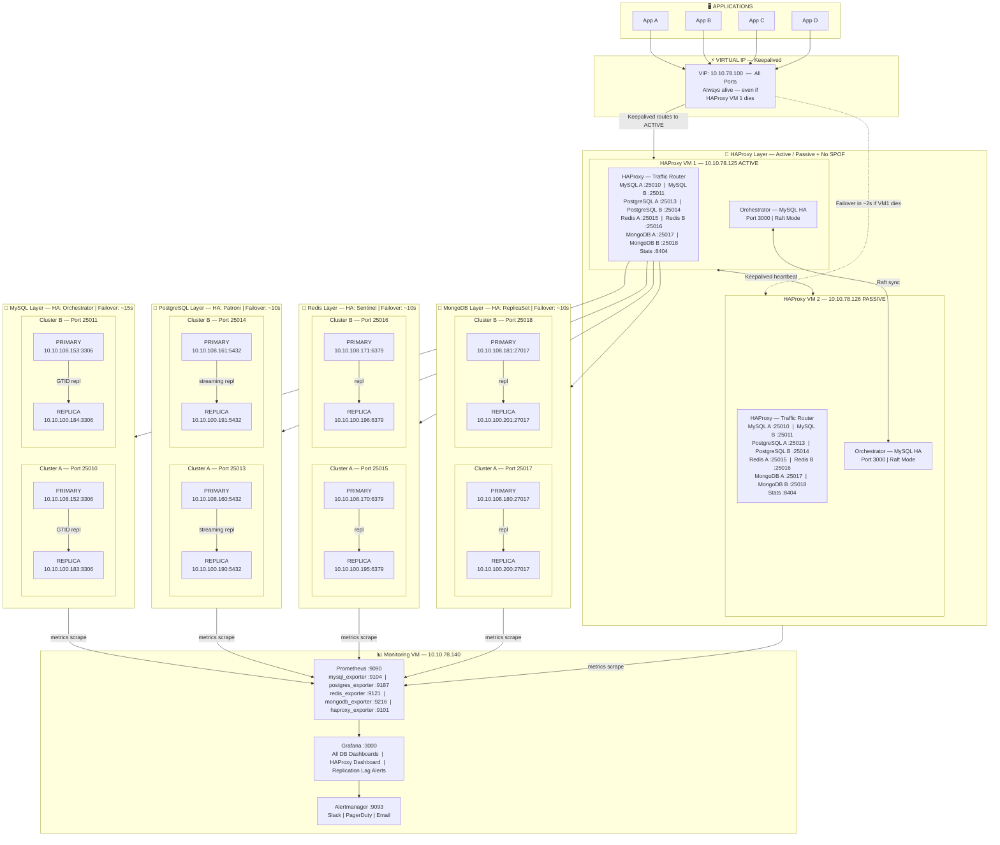
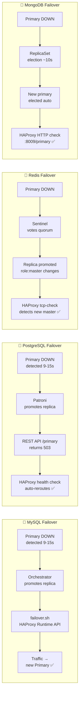
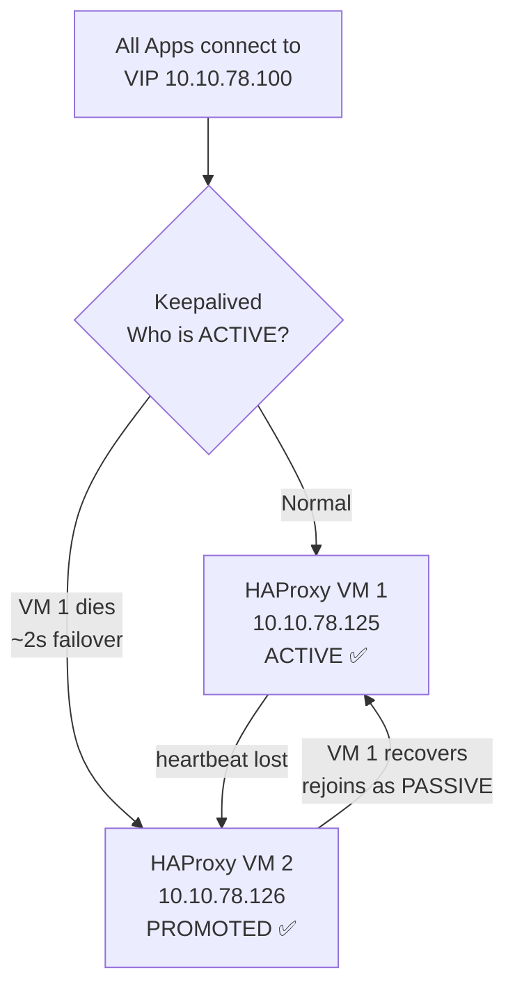
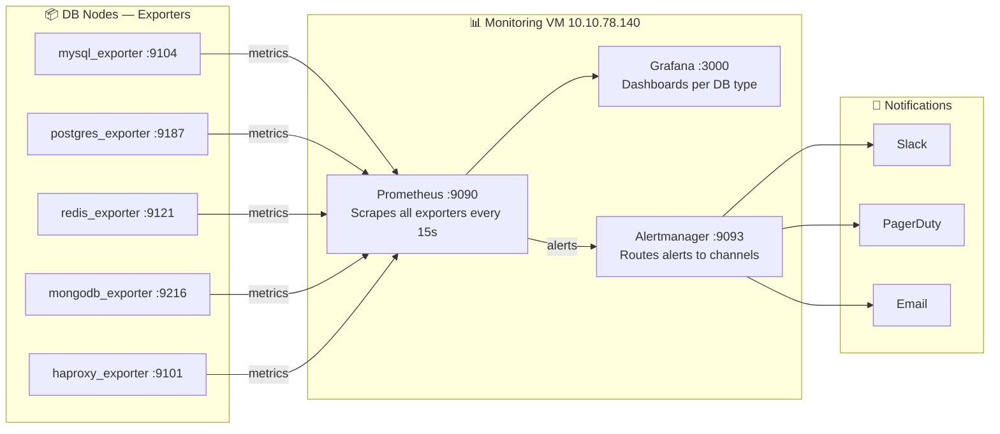

# Database Cluster Architecture
> High Availability Multi-DB Platform — HAProxy + Keepalived + Orchestrator

---

## Architecture Overview



---

## Failover Flow Per DB Type



---

## HAProxy Keepalived Failover



---

## Cluster Reference

### MySQL Clusters

| Cluster | Role | IP | Port | HA Manager |
|---|---|---|---|---|
| Cluster A | Primary | 10.10.108.152 | 3306 | Orchestrator |
| Cluster A | Replica | 10.10.100.183 | 3306 | Orchestrator |
| Cluster B | Primary | 10.10.108.153 | 3306 | Orchestrator |
| Cluster B | Replica | 10.10.100.184 | 3306 | Orchestrator |

### PostgreSQL Clusters

| Cluster | Role | IP | Port | HA Manager |
|---|---|---|---|---|
| Cluster A | Primary | 10.10.108.160 | 5432 | Patroni |
| Cluster A | Replica | 10.10.100.190 | 5432 | Patroni |
| Cluster B | Primary | 10.10.108.161 | 5432 | Patroni |
| Cluster B | Replica | 10.10.100.191 | 5432 | Patroni |

### Redis Clusters

| Cluster | Role | IP | Port | HA Manager |
|---|---|---|---|---|
| Cluster A | Primary | 10.10.108.170 | 6379 | Sentinel |
| Cluster A | Replica | 10.10.100.195 | 6379 | Sentinel |
| Cluster B | Primary | 10.10.108.171 | 6379 | Sentinel |
| Cluster B | Replica | 10.10.100.196 | 6379 | Sentinel |

### MongoDB Clusters

| Cluster | Role | IP | Port | HA Manager |
|---|---|---|---|---|
| Cluster A | Primary | 10.10.108.180 | 27017 | ReplicaSet |
| Cluster A | Replica | 10.10.100.200 | 27017 | ReplicaSet |
| Cluster B | Primary | 10.10.108.181 | 27017 | ReplicaSet |
| Cluster B | Replica | 10.10.100.201 | 27017 | ReplicaSet |

---

## Port Map

| DB Type | Cluster | Port | HA Manager | Health Check |
|---|---|---|---|---|
| MySQL | Cluster A | 25010 | Orchestrator | `mysql-check user haproxy_check post-41` |
| MySQL | Cluster B | 25011 | Orchestrator | `mysql-check user haproxy_check post-41` |
| PostgreSQL | Cluster A | 25013 | Patroni | `HTTP :8008/primary → 200 OK` |
| PostgreSQL | Cluster B | 25014 | Patroni | `HTTP :8008/primary → 200 OK` |
| Redis | Cluster A | 25015 | Sentinel | `tcp-check role:master` |
| Redis | Cluster B | 25016 | Sentinel | `tcp-check role:master` |
| MongoDB | Cluster A | 25017 | ReplicaSet | `HTTP :8009/primary → 200 OK` |
| MongoDB | Cluster B | 25018 | ReplicaSet | `HTTP :8009/primary → 200 OK` |
| HAProxy | Stats | 8404 | — | — |
| Orchestrator | Web UI | 3000 | — | — |
| Patroni | REST API | 8008 | — | — |
| Mongo Health | Sidecar | 8009 | — | — |

---

## HA Manager Responsibilities

| DB Type | HA Manager | Failover Trigger | Failover Time |
|---|---|---|---|
| MySQL | Orchestrator | Auto via hooks → HAProxy Runtime API | ~15s |
| MariaDB | Orchestrator | Auto via hooks → HAProxy Runtime API | ~15s |
| PostgreSQL | Patroni | Auto via REST API → HAProxy HTTP check | ~10s |
| Redis | Sentinel | Auto promotes master → HAProxy tcp-check | ~10s |
| MongoDB | ReplicaSet | Auto elects primary → HAProxy HTTP check | ~10s |
| HAProxy | Keepalived | VIP moves to passive VM | ~2s |

---

## HAProxy Configuration

```haproxy
#---------------------------------------------------------------------
# Global
#---------------------------------------------------------------------
global
    log         /dev/log local0
    log         /dev/log local1 notice
    chroot      /var/lib/haproxy
    stats socket /run/haproxy/admin.sock mode 660 level admin expose-fd listeners
    stats timeout 30s
    user        haproxy
    group       haproxy
    daemon
    maxconn     50000
    nbthread    4

#---------------------------------------------------------------------
# Defaults
#---------------------------------------------------------------------
defaults
    log             global
    mode            tcp
    option          tcplog
    option          dontlognull
    option          redispatch
    retries         3
    timeout connect     5s
    timeout client      60s
    timeout server      60s
    timeout check       2s
    timeout tunnel      3600s
    maxconn         20000

#---------------------------------------------------------------------
# Stats Dashboard
# Access: http://10.10.78.125:8404/stats
#---------------------------------------------------------------------
frontend stats
    bind                *:8404
    mode                http
    stats enable
    stats uri           /stats
    stats realm         HAProxy\ Statistics
    stats auth          admin:YourStatsPassword!
    stats refresh       10s
    stats show-legends
    stats show-node
    acl trusted_ip      src 10.10.0.0/16
    http-request deny   if !trusted_ip

#=====================================================================
# MYSQL CLUSTERS
#=====================================================================

#---------------------------------------------------------------------
# MySQL Cluster A — port 25010
#---------------------------------------------------------------------
frontend mysql_cluster_a
    bind                *:25010
    mode                tcp
    option              tcplog
    default_backend     mysql_back_a

backend mysql_back_a
    mode                tcp
    option              tcp-check
    option              mysql-check user haproxy_check post-41
    balance             first
    default-server      inter 3s rise 2 fall 3 on-marked-down shutdown-sessions
    server  mysql-primary-a  10.10.108.152:3306  check weight 100
    server  mysql-replica-a  10.10.100.183:3306  check weight 1 backup

#---------------------------------------------------------------------
# MySQL Cluster B — port 25011
#---------------------------------------------------------------------
frontend mysql_cluster_b
    bind                *:25011
    mode                tcp
    option              tcplog
    default_backend     mysql_back_b

backend mysql_back_b
    mode                tcp
    option              tcp-check
    option              mysql-check user haproxy_check post-41
    balance             first
    default-server      inter 3s rise 2 fall 3 on-marked-down shutdown-sessions
    server  mysql-primary-b  10.10.108.153:3306  check weight 100
    server  mysql-replica-b  10.10.100.184:3306  check weight 1 backup

#=====================================================================
# POSTGRESQL CLUSTERS
#=====================================================================

#---------------------------------------------------------------------
# PostgreSQL Cluster A — port 25013
#---------------------------------------------------------------------
frontend pgsql_cluster_a
    bind                *:25013
    mode                tcp
    option              tcplog
    default_backend     pgsql_back_a

backend pgsql_back_a
    mode                tcp
    option              httpchk GET /primary
    http-check expect   status 200
    balance             first
    default-server      inter 3s rise 2 fall 3 on-marked-down shutdown-sessions
    server  pgsql-primary-a  10.10.108.160:5432  check port 8008 weight 100
    server  pgsql-replica-a  10.10.100.190:5432  check port 8008 weight 1 backup

#---------------------------------------------------------------------
# PostgreSQL Cluster B — port 25014
#---------------------------------------------------------------------
frontend pgsql_cluster_b
    bind                *:25014
    mode                tcp
    option              tcplog
    default_backend     pgsql_back_b

backend pgsql_back_b
    mode                tcp
    option              httpchk GET /primary
    http-check expect   status 200
    balance             first
    default-server      inter 3s rise 2 fall 3 on-marked-down shutdown-sessions
    server  pgsql-primary-b  10.10.108.161:5432  check port 8008 weight 100
    server  pgsql-replica-b  10.10.100.191:5432  check port 8008 weight 1 backup

#=====================================================================
# REDIS CLUSTERS
#=====================================================================

#---------------------------------------------------------------------
# Redis Cluster A — port 25015
#---------------------------------------------------------------------
frontend redis_cluster_a
    bind                *:25015
    mode                tcp
    option              tcplog
    default_backend     redis_back_a

backend redis_back_a
    mode                tcp
    option              tcp-check
    tcp-check           send PING\r\n
    tcp-check           expect string +PONG
    tcp-check           send info\ replication\r\n
    tcp-check           expect string role:master
    tcp-check           send QUIT\r\n
    tcp-check           expect string +OK
    balance             first
    default-server      inter 3s rise 2 fall 3 on-marked-down shutdown-sessions
    server  redis-primary-a  10.10.108.170:6379  check weight 100
    server  redis-replica-a  10.10.100.195:6379  check weight 1 backup

#---------------------------------------------------------------------
# Redis Cluster B — port 25016
#---------------------------------------------------------------------
frontend redis_cluster_b
    bind                *:25016
    mode                tcp
    option              tcplog
    default_backend     redis_back_b

backend redis_back_b
    mode                tcp
    option              tcp-check
    tcp-check           send PING\r\n
    tcp-check           expect string +PONG
    tcp-check           send info\ replication\r\n
    tcp-check           expect string role:master
    tcp-check           send QUIT\r\n
    tcp-check           expect string +OK
    balance             first
    default-server      inter 3s rise 2 fall 3 on-marked-down shutdown-sessions
    server  redis-primary-b  10.10.108.171:6379  check weight 100
    server  redis-replica-b  10.10.100.196:6379  check weight 1 backup

#=====================================================================
# MONGODB CLUSTERS
#=====================================================================

#---------------------------------------------------------------------
# MongoDB Cluster A — port 25017
#---------------------------------------------------------------------
frontend mongo_cluster_a
    bind                *:25017
    mode                tcp
    option              tcplog
    default_backend     mongo_back_a

backend mongo_back_a
    mode                tcp
    option              httpchk GET /primary
    http-check expect   status 200
    balance             first
    default-server      inter 3s rise 2 fall 3 on-marked-down shutdown-sessions
    server  mongo-primary-a  10.10.108.180:27017  check port 8009 weight 100
    server  mongo-replica-a  10.10.100.200:27017  check port 8009 weight 1 backup

#---------------------------------------------------------------------
# MongoDB Cluster B — port 25018
#---------------------------------------------------------------------
frontend mongo_cluster_b
    bind                *:25018
    mode                tcp
    option              tcplog
    default_backend     mongo_back_b

backend mongo_back_b
    mode                tcp
    option              httpchk GET /primary
    http-check expect   status 200
    balance             first
    default-server      inter 3s rise 2 fall 3 on-marked-down shutdown-sessions
    server  mongo-primary-b  10.10.108.181:27017  check port 8009 weight 100
    server  mongo-replica-b  10.10.100.201:27017  check port 8009 weight 1 backup
```

---

## Keepalived Configuration

### HAProxy VM 1 — MASTER `/etc/keepalived/keepalived.conf`

```bash
vrrp_script chk_haproxy {
    script "killall -0 haproxy"
    interval 2
    weight   2
}

vrrp_instance VI_1 {
    state               MASTER
    interface           eth0
    virtual_router_id   51
    priority            101
    advert_int          1

    authentication {
        auth_type   PASS
        auth_pass   YourKeepalivedPass!
    }

    virtual_ipaddress {
        10.10.78.100/24
    }

    track_script {
        chk_haproxy
    }
}
```

### HAProxy VM 2 — BACKUP (same config, change these 2 lines)

```bash
    state               BACKUP
    priority            100
```

---

## Orchestrator Raft Configuration

```json
{
  "RaftEnabled": true,
  "RaftDataDir": "/var/lib/orchestrator",
  "RaftBind": "10.10.78.125",
  "RaftNodes": [
    "10.10.78.125",
    "10.10.78.126"
  ],
  "DefaultRaftPort": 10008,
  "MySQLTopologyUser": "orchestrator",
  "MySQLTopologyPassword": "Orchestrator!2024",
  "MySQLTopologyPort": 3306,
  "BackendDB": "sqlite",
  "SQLite3DataFile": "/var/lib/orchestrator/orchestrator.db",
  "RecoveryEnabled": true,
  "RecoverMasterClusterFilters": ["*"],
  "PostMasterFailoverProcesses": [
    "/etc/orchestrator/failover.sh {successorHost} {successorPort} {failedHost}"
  ]
}
```

---

## MongoDB Health Sidecar

> Required on each MongoDB node — exposes HTTP `/primary` for HAProxy health check

```bash
# /usr/local/bin/mongo-health.sh
#!/bin/bash
IS_PRIMARY=$(mongosh --quiet --eval "db.isMaster().ismaster" 2>/dev/null)
if [ "$IS_PRIMARY" == "true" ]; then
    echo -e "HTTP/1.1 200 OK\r\nContent-Length: 2\r\n\r\nOK"
else
    echo -e "HTTP/1.1 503 Service Unavailable\r\nContent-Length: 9\r\n\r\nnot-primary"
fi
```

```bash
# Run as service on port 8009
while true; do
    /usr/local/bin/mongo-health.sh | nc -l -p 8009 -q 1
done
```

---

## Redis Sentinel HAProxy Notify Script

```bash
# /etc/redis/reconfig-haproxy.sh
#!/bin/bash
NEW_MASTER_IP=$6
OLD_MASTER_IP=$4
HAPROXY_SOCKET="/run/haproxy/admin.sock"

# Disable old master
echo "show servers state" | socat stdio "$HAPROXY_SOCKET" | \
awk -v old="$OLD_MASTER_IP" '{if($4==old) print $2" "$3}' | \
while read backend server; do
    echo "disable server $backend/$server" | socat stdio "$HAPROXY_SOCKET"
done

# Enable new master
echo "show servers state" | socat stdio "$HAPROXY_SOCKET" | \
awk -v new="$NEW_MASTER_IP" '{if($4==new) print $2" "$3}' | \
while read backend server; do
    echo "enable server $backend/$server"  | socat stdio "$HAPROXY_SOCKET"
    echo "set server $backend/$server weight 100" | socat stdio "$HAPROXY_SOCKET"
done

sudo systemctl reload haproxy
```

---

## Monitoring Stack



---

## Production Readiness Checklist

| Component | Status | Notes |
|---|---|---|
| HAProxy Active/Passive | ✅ | Keepalived VIP |
| HAProxy tunnel timeout | ✅ | `timeout tunnel 3600s` added |
| MySQL HA | ✅ | Orchestrator + Raft |
| PostgreSQL HA | ✅ | Patroni + HTTP check |
| Redis HA | ✅ | Sentinel + notify script |
| MongoDB HA | ✅ | ReplicaSet + sidecar HTTP check |
| No SPOF on proxy layer | ✅ | 2x HAProxy + Keepalived |
| No SPOF on HA manager | ✅ | Orchestrator Raft on both VMs |
| Monitoring isolated | ✅ | Separate VM |
| Metrics per DB type | ✅ | 5 exporters |
| Alerts configured | ✅ | Slack / PagerDuty / Email |

---

## Summary

```
✅ Single VIP entry point       — apps connect to one IP always
✅ HAProxy Active/Passive       — no proxy SPOF via Keepalived
✅ Separate port per cluster    — full traffic isolation
✅ Correct HA tool per DB type  — Orchestrator / Patroni / Sentinel / ReplicaSet
✅ Correct health check per DB  — mysql-check / HTTP check / tcp-check role:master
✅ Auto failover all DB types   — zero manual intervention
✅ Zero cross-cluster impact    — cluster A down = others unaffected
✅ Monitoring per DB type       — Prometheus exporters + Grafana
✅ Alerting                     — Alertmanager → Slack / PagerDuty / Email
✅ Scalable                     — add new cluster = add frontend/backend block only
```